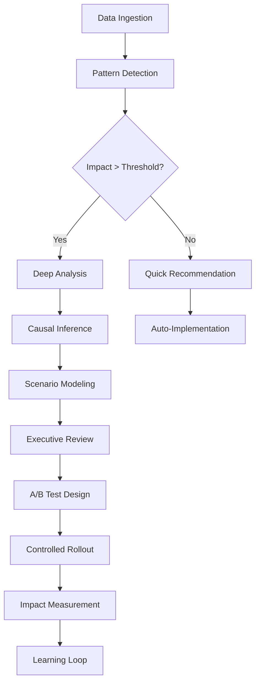

# Strategic Growth Predictor (SGP)

## Visión Ejecutiva

El Strategic Growth Predictor es el motor de inteligencia que transforma datos operativos en decisiones estratégicas accionables. Combina análisis cuantitativo riguroso con narrativas ejecutivas claras para maximizar el crecimiento y minimizar riesgos.

## Arquitectura del Sistema

### Principio Core
**"Números duros, decisiones claras, acciones medibles"**

El SGP opera en tres capas:
1. **Capa de Datos**: Ingesta y procesamiento de métricas operativas
2. **Capa de Inteligencia**: Modelos predictivos + análisis causal
3. **Capa de Acción**: Recomendaciones priorizadas con impacto estimado

## Módulos Principales

### 1. Bottleneck Miner
**Propósito**: Identificar y priorizar cuellos de botella operativos que limitan el crecimiento

**Capacidades**:
- Análisis de flujo de procesos (lead → cierre → entrega)
- Detección de patrones de retraso recurrentes
- Identificación de recursos sobrecargados
- Correlación entre bottlenecks y pérdida de margen

**Métricas clave**:
- Time-to-Lead Response (TLR)
- Proposal Turnaround Time (PTT)
- Project Velocity Index (PVI)
- Resource Utilization Rate (RUR)

### 2. SpendPlan Optimizer
**Propósito**: Optimizar asignación de presupuesto de marketing/ventas para maximizar ROI

**Capacidades**:
- Media Mix Modeling (MMM) con efectos de saturación
- Attribution multi-touch con decay temporal
- Predicción de CAC por canal/campaña
- Simulación de escenarios de inversión

**Outputs**:
- Asignación óptima por canal (%)
- ROI esperado con intervalos de confianza
- Punto de saturación por canal
- Recomendaciones de timing

### 3. Pricing & Scope Advisor
**Propósito**: Optimizar estrategia de pricing y bundling por segmento

**Capacidades**:
- Análisis de elasticidad precio-demanda
- Identificación de add-ons de alto margen
- Segmentación por willingness-to-pay
- Competitive intelligence automático

**Estrategias**:
- Value-based pricing por vertical
- Bundle optimization (qué servicios combinar)
- Discount threshold analysis
- Upsell/cross-sell triggers

### 4. Contract Risk Scanner
**Propósito**: Identificar riesgos contractuales antes de firmar

**Red Flags monitoreados**:
- Cláusulas de penalización asimétricas
- Scope creep no limitado
- Plazos de pago extendidos (>60 días)
- Responsabilidades ilimitadas
- Ausencia de cláusulas de salida

**Output**: Risk score (0-100) con mitigaciones específicas

### 5. Executive Narrative Generator
**Propósito**: Sintetizar insights complejos en narrativas ejecutivas de 1 página

**Estructura estándar**:
1. **Situación** (3 líneas): Qué está pasando ahora
2. **Complicación** (2 líneas): Qué riesgo/oportunidad existe
3. **Pregunta** (1 línea): Decisión clave a tomar
4. **Respuesta** (3 líneas): Recomendación con trade-offs
5. **Próximos pasos** (3 bullets): Acciones inmediatas

## Sistema de Scoring y Confianza

### Impact Score (0-100)
```
Impact = (Revenue_Delta × 0.4) + (Margin_Delta × 0.3) + (Velocity_Delta × 0.2) + (Risk_Reduction × 0.1)
```

### Confidence Level
- **High (>80%)**: Datos históricos robustos, patrón claro
- **Medium (50-80%)**: Tendencia emergente, requiere validación
- **Low (<50%)**: Hipótesis basada en analogías, requiere piloto

## Flujo de Decisión Inteligente



## Casos de Uso Prioritarios

### Caso 1: Aceleración del Ciclo de Ventas
**Situación**: CPQ promedio 5 días, competencia en 2 días
**Detección**: Bottleneck en aprobación de descuentos
**Recomendación**: Pre-aprobar descuentos <15% para proyectos <$50K
**Impacto esperado**: -60% tiempo CPQ, +25% win rate
**Confianza**: 85% (basado en 180 cotizaciones históricas)

### Caso 2: Optimización de Mix de Marketing
**Situación**: 70% presupuesto en Google Ads, ROI decreciente
**Detección**: Saturación en SEM, LinkedIn infrautilizado
**Recomendación**: Rebalancear: Google 45%, LinkedIn 30%, Referrals 25%
**Impacto esperado**: +40% leads calificados, -20% CAC
**Confianza**: 72% (requiere test de 30 días)

### Caso 3: Pricing por Valor
**Situación**: Margen 18%, objetivo 25%
**Detección**: Underpricing en segmento enterprise
**Recomendación**: +20% precio en proyectos >$100K con ROI demostrable
**Impacto esperado**: +5pp margen, -10% volumen, +15% revenue neto
**Confianza**: 68% (validar con 5 propuestas piloto)

## Métricas de Éxito del SGP

### Leading Indicators (semanales)
- Recomendaciones generadas
- Recomendaciones aceptadas (%)
- Tiempo promedio de decisión
- Accuracy de predicciones

### Lagging Indicators (mensuales)
- Δ Revenue atribuible a SGP
- Δ Margen atribuible a SGP
- Reducción de ciclos operativos
- ROI del sistema SGP

## Roadmap de Implementación

### Sprint 1-2: Foundation
- [ ] Conectar fuentes de datos (CRM, CPQ, Finance)
- [ ] Implementar KPI dashboard básico
- [ ] Crear primer Executive Narrative manual

### Sprint 3-4: Intelligence Layer
- [ ] Bottleneck Miner v1
- [ ] Alertas automáticas de anomalías
- [ ] Primeras recomendaciones con scoring

### Sprint 5-6: Optimization
- [ ] SpendPlan Optimizer básico
- [ ] A/B testing framework
- [ ] Learning loop para feedback

### Sprint 7-8: Scale
- [ ] Contract Risk Scanner
- [ ] Pricing Advisor
- [ ] API para integraciones externas

## Principios de Diseño

1. **Explicabilidad sobre complejidad**: Mejor un modelo simple explicable que uno complejo opaco
2. **Acción sobre análisis**: Cada insight debe tener next steps claros
3. **Medición continua**: Todo experimento se mide y documenta
4. **Humano en el loop**: Decisiones críticas requieren aprobación
5. **Aprendizaje incremental**: El sistema mejora con cada decisión tomada

## Stack Técnico Recomendado

### Analytics & ML
- **Python**: Scikit-learn, XGBoost, Prophet
- **R**: Robyn (MMM), CausalImpact
- **Databases**: PostgreSQL + TimescaleDB para series temporales

### Orquestación
- **Airflow/Dagster**: Pipeline de datos
- **Metabase/Superset**: Visualización
- **PostHog/Mixpanel**: Product analytics

### Deployment
- **Netlify Functions**: Procesamiento serverless
- **Supabase**: Backend as a Service
- **Vercel Edge**: API endpoints de baja latencia

## Consideraciones Éticas y de Governance

### Transparencia
- Todos los modelos deben ser auditables
- Las recomendaciones incluyen reasoning explícito
- Se documentan assumptions y limitaciones

### Fairness
- Monitoreo de sesgo en recomendaciones
- Validación humana para decisiones de alto impacto
- Proceso de apelación para recomendaciones

### Privacy
- Cumplimiento GDPR/CCPA
- Anonimización de datos sensibles
- Opt-out para tracking individual

## Conclusión

El SGP no es solo una herramienta de análisis, es un sistema de amplificación de inteligencia empresarial. Combina lo mejor del análisis cuantitativo con la claridad narrativa necesaria para la toma de decisiones ejecutivas.

**El objetivo final**: Convertir a Cuarzo (y futuros clientes) en organizaciones data-driven que toman decisiones 10x más rápido con 10x más confianza.